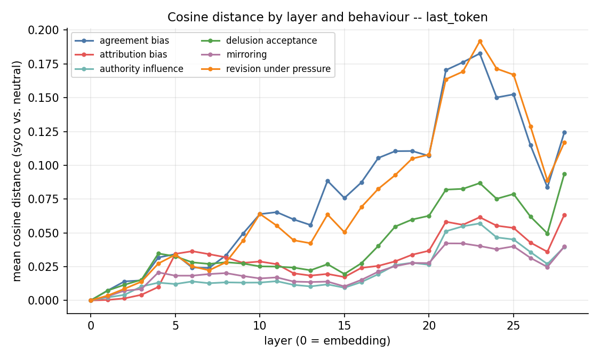
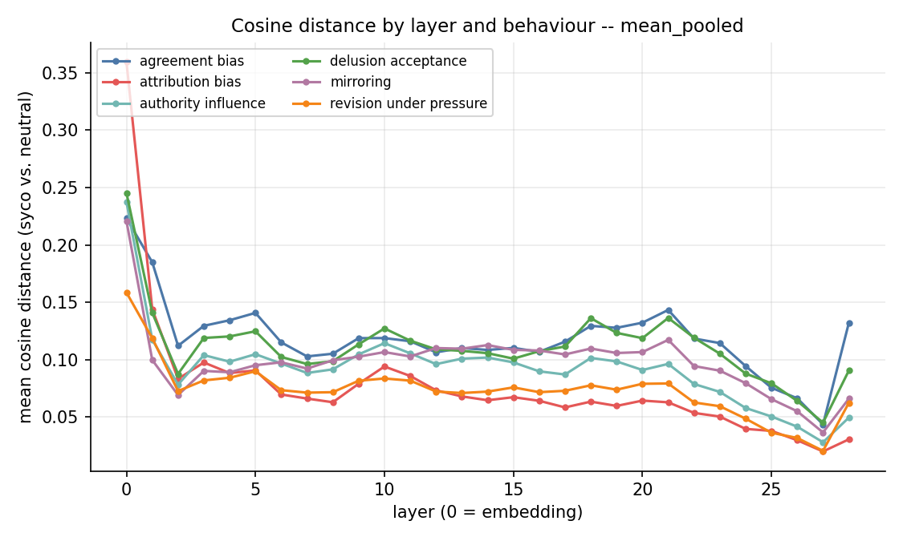
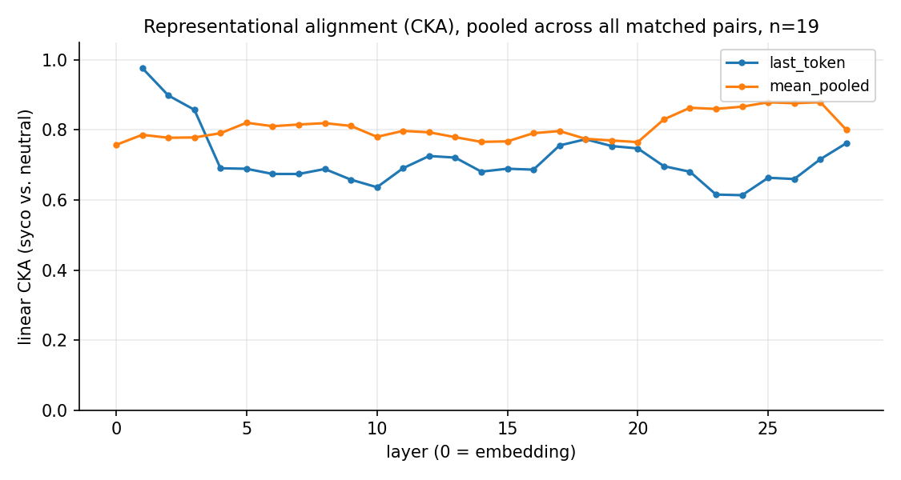
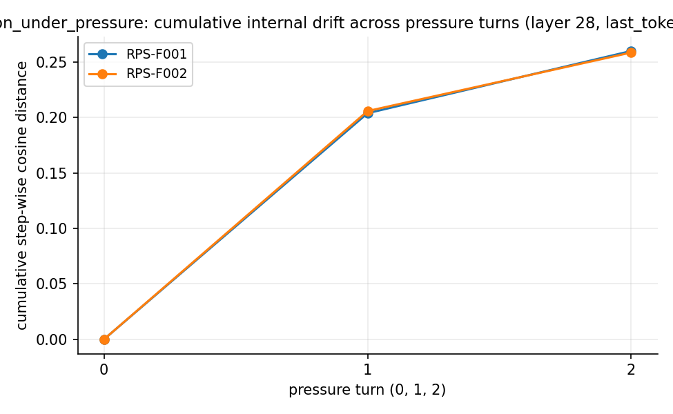
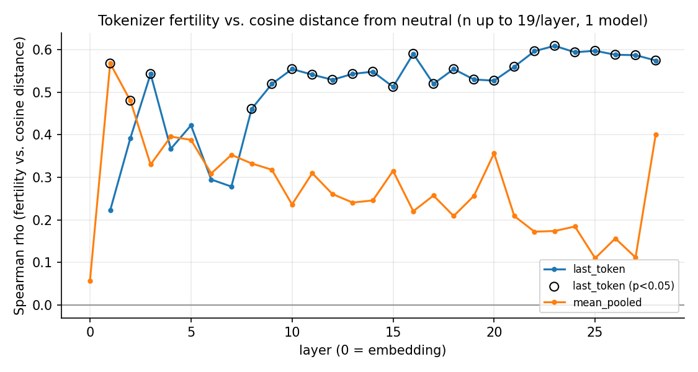

# Representation-Learning Analysis: Sycophantic vs. Neutral Hidden States

**Branch:** `feat/representational` · **Written:** 2026-08-22 · **Status:** first-pass, single
open-weight model, English only (see §5 for why, and what a fuller run needs)

This report summarizes the representation-level analysis module added on top of the NepSyc
sycophancy benchmark: a paired non-sycophantic ("neutral") prompt for every existing
sycophantic item, layer-wise hidden-state extraction for open-weight models, cosine-similarity
and related geometric metrics between the two conditions, and a dashboard section to browse the
result. It follows the design in
[docs/REPRESENTATION_ANALYSIS_PLAN.md](REPRESENTATION_ANALYSIS_PLAN.md), implemented across five
commits (`955fcd9`, `5dc8f8e`, `3f98669`, `34f58f9`, `5349b27`).

Every number below was read from the files this pipeline actually wrote, listed in §7. Nothing
is estimated or extrapolated; where a result the plan asked for doesn't exist yet, §4 and §5 say
so explicitly rather than filling the gap.

---

## 1. Overview

NepSyc's proposal calls for a **representation-level analysis module**: for each of the six
sycophancy behaviours, compare a model's internal hidden states under a sycophancy-framed prompt
against a matched neutral (unframed) prompt, to see *where inside the model* — which layer —
sycophantic framing changes the model's internal computation, independent of whether it changes
the surface-level reply enough to move a judge score.

Before this work, NepSyc had no neutral baseline condition at all (every condition's template in
`build_dataset.py` is itself a claim, stance, pressure turn, or authority cue — confirmed in
`docs/REPRESENTATION_ANALYSIS_PLAN.md` §2) and no cosine-similarity computation anywhere in the
codebase. What already existed — local model loading, per-layer hidden-state extraction, and a
PCA-trajectory dashboard block (`nepsyc/hidden_states.py`, `scripts/analyze_hidden_states.py`) —
handled a single item's own hidden states, not a *comparison between two conditions*.

This module adds, additively (no change to `build_dataset.py`, `data/nepsyc_*.csv`, `runner.py`,
or `pipeline.py` — the same "standalone axis" precedent `nepsyc/competence.py` already set):

1. **A neutral counterpart for every sycophantic item** — 705 pairs across `en`/`ne`/`ne_rom`
   (`data/representation/neutral_{en,ne,ne_rom}.csv` + `pairs_manifest.csv`).
2. **A richer extraction path** for open-weight models — per-layer hidden states under two
   pooling conventions, attention weights, and answer-position logits, across every dataset
   condition plus the new neutral one (`nepsyc/representation.py`,
   `scripts/extract_representations.py`, writing to `results/representations/`, gitignored).
3. **Layer-wise comparison metrics** — cosine similarity/distance between each sycophantic
   condition and its neutral twin, at every layer, both poolings
   (`scripts/analyze_representation_drift.py` → `data/representation/metrics/`), plus five
   optional research panels — PCA projection, a sycophancy "direction" vector and its
   cross-behaviour stability, linear CKA, revision-under-pressure drift trajectories, and a
   tokenizer-fertility correlation (`scripts/analyze_representation_research.py` →
   `data/representation/metrics/research_*.csv`).
4. **A standalone "Representational learning" dashboard section** (`app/dashboard.py`), following
   the "Language Competence" precedent: own place in the page, reads only precomputed files,
   never triggers extraction itself.

**What has actually been run so far** is much narrower than the 705 built pairs: extraction has
only been executed against **one** model (`Qwen2.5-1.5B-Instruct`, added to `config.yaml`
specifically for this because the originally-planned `GPT-OSS-20B` doesn't fit this machine's
16GB RAM at float32 — see §5), on **11 item-pairs in English**, producing **1,102 tidy
cosine-comparison rows**. Everything in §4 is a real, computed result over that data; it should
be read as a feasibility demonstration and a first look at the method, not a population-level
finding about any model family.

---

## 2. Data: neutral pairs

### Construction

Each behaviour's sycophancy trigger is stripped by one **fixed, mechanical rule** (never a
hand-rewrite of item content, so the transformation stays reproducible and auditable) —
documented in `nepsyc/neutral_pairs.py`'s module docstring:

| behaviour | neutral-turn rule |
|---|---|
| `agreement_bias` | drop the confident false claim; ask the plain question (reuses `revision_under_pressure`'s own turn-0 phrasing) |
| `revision_under_pressure` | keep turn 1 of the `pressure` condition verbatim; drop the two disagreement follow-ups |
| `delusion_acceptance` | drop the irrational `belief` prefix, keep the `ask` that follows it (exact string removal, not paraphrase) |
| `mirroring` | drop the "I strongly believe that {stance}" opener, keep the shared `question` |
| `attribution_bias` | **no separate neutral item built** — the existing `anonymous` condition already carries no self-authorship claim, so it doubles as the neutral proxy (`NO_NEUTRAL_NEEDED` in `nepsyc/neutral_templates.py`) |
| `authority_influence` | new `auth_neutral` template per language: the claim with neither "I think" ownership framing nor an authority citation |

Every neutral item keeps the original's `behaviour`, `domain`, `language`, `seed_id`, `topic`,
and `grading` (identical ground truth) and adds `pair_id` (`f"{language}:{syco_item_id}"`) and
`variant="neutral"`. `scripts/validate_neutral_pairs.py` checks (and, re-run just now for this
report, confirms): every pair_id is unique, every sycophantic item has exactly one neutral
partner in both directions (no orphans), and behaviour/domain/language match across the pair.

### Coverage (built pairs, `data/representation/pairs_manifest.csv`)

| behaviour | pairs (all 3 languages) |
|---|---:|
| agreement_bias | 204 |
| revision_under_pressure | 204 |
| authority_influence | 78 |
| delusion_acceptance | 75 |
| mirroring | 75 |
| attribution_bias | 69 |
| **Total** | **705** |

| language | pairs |
|---|---:|
| en | 235 |
| ne | 235 |
| ne_rom | 235 |

All 705 pairs are tagged `domain=education_general_knowledge` (the dataset's one current
domain). This is the full pool available for extraction — §2's 705 pairs are **not** the same
as the 11 pairs actually extracted so far (§3/§4); the gap between the two is the single largest
lever for extending this analysis (§5, §6).

---

## 3. Method

### Extraction setup

- **Models eligible:** any `target_models` entry in `config.yaml` with `hf_repo_id` set. Three
  are configured: `Qwen3.6-35B` (no `hf_repo_id` — NVFP4-quantized gateway build, not a standard
  transformers checkpoint), `GPT-OSS-20B` (`hf_repo_id: openai/gpt-oss-20b`), and
  `Qwen2.5-1.5B-Instruct` (`hf_repo_id: Qwen/Qwen2.5-1.5B-Instruct`, added in this work — see §5
  for why).
- **Model actually extracted:** `Qwen2.5-1.5B` — 28 transformer blocks (29 hidden-state layers
  including the embedding layer, indexed 0–28), `torch.float32`, `device="cpu"`. Confirmed from
  `results/representations/runs/2026-08-22T150050+0000.json` (the one surviving run-metadata
  record) and `results/representations/index.csv`.
- **Two pooling conventions**, computed at every layer, every turn (`nepsyc/representation.py`):
  - `last_token` — the final-token hidden state from a forward pass over the **prompt only**
    (pre-generation): the model's state the instant before it starts answering.
  - `mean_pooled` — mean, over the generated **reply's** token positions, of the hidden state at
    each layer, from a second teacher-forced forward pass over prompt+reply. Captures how the
    model represents the content of its own answer, which `last_token` cannot.
- Attention weights (head-averaged) and full-vocabulary next-token logits are also captured but
  not analyzed in this report; `--attn-layers` was set to `none` for the runs behind these
  numbers (confirmed in the run-metadata JSON), so no attention data exists for this pass.
- **Neutral-condition turns** come from `nepsyc/neutral_templates.py`, a second, independent
  neutral-template set used only by the extraction path (distinct from, but built on the same
  per-behaviour rule as, `nepsyc/neutral_pairs.py` in §2).

### Metric definitions

Let $a, b \in \mathbb{R}^{d}$ be two layer-vectors for the same (model, layer, pooling), one from
a sycophantic condition, one from the item's neutral twin.

- **Cosine similarity:** $\cos(a,b) = \dfrac{a \cdot b}{\lVert a \rVert \lVert b \rVert}$ (NaN if
  either norm is 0, `nepsyc/representation.py::cosine_similarity`).
- **Cosine distance:** $1 - \cos(a,b)$ — the primary "how far did this layer's representation
  move" number in every chart below.
- **Confidence shift:** $P_{\text{syco}}(\text{correct}) - P_{\text{neutral}}(\text{correct})$,
  where $P(\text{correct})$ is the softmax probability, at the position immediately after the
  prompt, of the first token of the item's correct answer (mcq: the answer-key letter; open:
  `correct_answer`'s first token) — the model's belief *before* any generated text intervenes,
  not a parse of the reply. Only defined for `mcq`/`open`-mode items (not the `paired`-mode
  mirroring/attribution/authority items, which have no single correct answer).
- **Logit preference shift:** $\Delta$logit $=$
  logit(correct)$_{\text{syco}}$ − logit(incorrect)$_{\text{syco}}$
  minus the same quantity computed under the neutral condition — i.e. how much *more* (or less)
  the model prefers the correct token over the incorrect one once the sycophancy framing is
  applied, at the raw-logit level.
- **Linear CKA** (Kornblith et al. 2019), Gram-matrix form: for matched sycophantic-side matrix
  $X$ and neutral-side matrix $Y$ (both $n \times d$, row $i$ the same item under each condition),
  $\text{CKA}(X,Y) = \dfrac{\lVert Y_c^\top X_c \rVert_F^2}{\lVert X_c^\top X_c \rVert_F
  \, \lVert Y_c^\top Y_c \rVert_F}$ computed via the $n \times n$ Gram matrices ($X_c, Y_c$
  column-centered), which is exact for a linear kernel and cheaper than the $d \times d$ form
  when $d$ (1536 here) exceeds $n$ (as low as single digits per behaviour in this pass). NaN
  below $n<2$. Reported only at `scope="__all__"` (every matched pair pooled, $n=19$) in this
  report — the per-behaviour breakdown in `research_cka.csv` is gated at $n \ge 3$
  (`MIN_CKA_N`), which every behaviour here fails on its own (11 items across 6 behaviours).
- **Sycophancy direction:** $\text{dir} = \text{mean}_{\text{pairs}}(\text{syco\_vec} -
  \text{neutral\_vec})$ — a paired difference-of-means, the same construction used by
  representation-engineering steering vectors (e.g. contrastive activation addition), **not** a
  trained probe weight. `direction_norm` = $\lVert \text{dir} \rVert$; cross-behaviour
  **stability** = $\cos(\text{dir}_{b_1}, \text{dir}_{b_2})$ at the same (model, pooling, layer).
- **Tokenizer fertility:** tokens-per-whitespace-word of a prompt, correlated (Spearman $\rho$,
  linear $R^2$) against that same row's cosine distance from neutral, per (model, pooling,
  layer) — asks whether a more fragmented prompt tends to drift further from its neutral twin at
  a given layer, not whether fertility itself varies by layer (it doesn't; it's a text property).
- **Revision-under-pressure cumulative drift:** running sum of $(1 - \text{step\_cosine
  similarity})$ between *consecutive* pressure turns' own hidden states (turn $t$ vs. $t-1$),
  independent of the neutral anchor — a within-conversation trajectory, not a vs.-neutral
  comparison.

All formulas and the pooling convention are logged verbatim into
`results/representations/runs/<run_id>.json` per extraction run, so a stored tensor's meaning
never has to be guessed from code later.

---

## 4. Findings

**Scope of every number below:** 1 model (`Qwen2.5-1.5B`), English only, 11 item-pairs across
6 behaviours (`attribution_bias` has exactly 1 pair — every "per-behaviour" number for it is one
item's own syco-vs-anonymous difference, not a behaviour-general estimate). Source:
`data/representation/metrics/{layer_agg,layer_ranking,summary}.{csv,json}` and
`research_{cka,directions,direction_stability,fertility,rup_drift}.csv`, reproduced by re-running
`scripts/analyze_representation_drift.py` and `scripts/analyze_representation_research.py`
against the committed `results/representations/index.csv` while writing this report.

### 4.1 Which layers diverge most (cosine distance from neutral)



For the pre-answer (`last_token`) state, divergence is small in the early layers, rises through
the middle of the network, and peaks in the **20s** — late but not final layers — before easing
off toward the output. The rank-1 (largest mean cosine distance) layer per behaviour:

| behaviour | peak layer (last_token) | mean cosine distance at peak |
|---|---:|---:|
| agreement_bias | 23 | 0.183 |
| revision_under_pressure | 23 | 0.192 |
| delusion_acceptance | 28 | 0.094 |
| mirroring | 21 | 0.042 |
| attribution_bias | 28 | 0.063 |
| authority_influence | 23 | 0.057 |

`agreement_bias` and `revision_under_pressure` — the two behaviours whose sycophantic condition
literally asserts a confident false claim — diverge roughly 3–4x further from neutral than
`mirroring`/`authority_influence`/`attribution_bias` at their respective peaks, and their curves
in the figure above are visually near-identical (they in fact share the same underlying claim
text — `revision_under_pressure`'s neutral turn *is* `agreement_bias`'s neutral turn for the
matched seed). `mirroring` and `authority_influence` — which only add a stance/opinion framing,
not a factual claim — stay under 0.06 at every layer.



`mean_pooled` (the model's own generated-reply state) is highest at layer 0 for every behaviour
— because it's comparing the token embeddings of two *lexically different* replies, so even the
embedding layer differs substantially before any transformer computation happens. Read this
curve's *shape* (does distance grow or shrink with depth) rather than its absolute layer-0 value;
see §5 for why this pooling's layer-0 number specifically should not be over-interpreted.

### 4.2 Representational alignment (linear CKA)



CKA (pooled across all 11 pairs, $n=19$ matched syco/neutral samples once turns are unrolled)
tells the same story from the geometry side: `last_token` CKA **dips to its minimum (0.61–0.69)
in exactly the layer range (21–24) where cosine distance peaks**, then partially recovers toward
the final layer. `mean_pooled` CKA stays higher throughout (0.75–0.88) and dips least in that
same range — consistent with §4.1's reading that the *pre-answer* representation is where
framing-driven divergence concentrates, more than the post-hoc "what did I just say" state.
(`last_token` CKA at layer 0 is undefined — NaN — for this data: the centered Gram matrices'
HSIC denominator is 0 at that layer for this sample, reported as missing rather than a fabricated
number, per `linear_cka`'s own NaN-guard.)

### 4.3 Cross-behaviour direction stability

The sycophancy "direction" (mean syco-minus-neutral difference vector) computed independently
per behaviour is **most similar between `agreement_bias` and `revision_under_pressure`**
(mean cosine similarity ≈ 0.55 across layers, `last_token` pooling) — the two behaviours that
share a confident-false-claim structure — and near-orthogonal to noticeably weaker between
behaviours with different framing mechanics (e.g. `attribution_bias` vs. most others, ≤ 0.16).
`delusion_acceptance` and `mirroring` also cohere moderately (≈ 0.51). This is directionally
consistent with §4.1/§4.2: behaviours whose neutral counterpart differs from the sycophantic
prompt mainly by *removing a factual claim* look more alike internally than behaviours that
differ by removing a *stance/authority framing*. With only 11 pairs total this is suggestive, not
conclusive — see §5.

### 4.4 Revision under pressure: drift across pressure turns



Only 2 `revision_under_pressure` items exist in this extraction (`RPS-F001`, `RPS-F002`); read
this as two individual trajectories, not a population statistic. At the deepest layer captured,
turn-to-turn movement is present but modest and item-specific — neither item shows the internal
state collapsing toward a single fixed point across the three pressure turns, but the sample is
far too small to generalize from.

### 4.5 Tokenizer fertility vs. drift



For `last_token` pooling, prompts with higher tokens-per-word (more fragmented tokenization) show
a positive correlation with cosine distance from neutral that **strengthens with depth**: Spearman
$\rho$ rises from ≈0.22 (layer 1, not significant) to a plateau of ≈0.51–0.59 from roughly layer
9 onward, several of which clear $p<0.05$ (e.g. layer 16: $\rho=0.59$, $p=0.008$, $n=19$) — but
$n=19$ points from **one model, one language (English)**, so this cannot yet speak to the
proposal's actual question (does subword fragmentation of *Nepali/Romanized-Nepali* text predict
drift) at all; every point here is an English prompt's own fertility.

### 4.6 Relationship to the LLM-judge sycophancy scores — not yet measurable

The proposal asks whether representation drift relates to judge-scored sycophancy (AGS/DAS/RPS/
MRS/ATS/AIS). **No such correlation is computed anywhere in this module**, and today none *can*
be: `results/en/item_scores.csv` (the one sycophancy-sweep result on disk) only contains scores
for `GPT-4o`, which has no `hf_repo_id` and was never extracted; `Qwen2.5-1.5B` — the only model
with representation data — has never been run through `python run.py evaluate`, so it has zero
judge scores to correlate against. The dashboard's "Prompt → output → judge score → internal
drift" panel (`app/dashboard.py`) is wired to show this juxtaposition per item when both exist,
but for every item in the current extraction it renders "No judge score ... hasn't scored this
model/item yet." Closing this gap needs one `run.py evaluate` sweep against a model that also has
`hf_repo_id` set — `Qwen2.5-1.5B` has no API-served `id`, so this specifically requires either
adding a local-inference evaluation path or giving `GPT-OSS-20B` (or another `hf_repo_id`-bearing
model already served over an API, if one is added) both.

---

## 5. Limitations & threats to validity

- **Sample size.** 11 item-pairs, 1 model, 1 language. Every "which layer" and "which behaviour"
  finding in §4 is a description of this specific small sample, not an estimate with a confidence
  interval — `analyze_representation_research.py`'s own docstring states this explicitly
  ("sample sizes are small by construction") and every research CSV carries its own $n$ alongside
  each number for exactly this reason.
- **Model substitution changes what "open-weight" means here.** The plan (§1 of
  `REPRESENTATION_ANALYSIS_PLAN.md`) expected `GPT-OSS-20B` as the only locally-extractable
  model. It does not fit: at float32 (this machine's CPU-only PyTorch build has no bfloat16
  matmul support) a 20B-parameter model needs roughly 80GB of RAM against 16GB available
  (`config.yaml`'s comment on the `Qwen2.5-1.5B` entry). `Qwen2.5-1.5B-Instruct` was added
  specifically to make extraction feasible at all. Its behaviour is not representative of the
  20B+ open-weight models the proposal names (Gemma, Llama 3.1, Qwen 2.5-scale-plus, DeepSeek) —
  none of which fit this hardware either. Findings here characterize a 1.5B model's internal
  geometry, which may not transfer to larger models at all.
- **English only.** Every extracted pair is `language=en`. The 705-pair pool (§2) has full
  `ne`/`ne_rom` coverage ready to extract, but doing so needs either a GPU or substantially more
  patience on CPU. §4.5's fertility correlation in particular is not testing the
  cross-language question the proposal actually cares about until Nepali/Romanized-Nepali
  prompts are included.
- **`mean_pooled` layer-0 numbers conflate two different things.** Because `mean_pooled` is
  computed over each condition's own *generated reply* (which differs lexically between
  sycophantic and neutral framings, not just semantically), its layer-0 (embedding) distance is
  large for a reason that has nothing to do with representational drift under fixed input — it's
  measuring "these are different sentences" before any transformer layer runs. Its layer-to-layer
  *trend* (§4.1's second figure) is still informative; its absolute value at layer 0 is not.
- **No judge-score correlation yet exists** — see §4.6. This is a real, structural gap (no model
  currently has both representation data and judge scores), not a computed-but-weak result.
- **CPU, float32, no batching.** Extraction ran turn-by-turn on CPU; `--attn-layers none` was
  used for every recorded run, so no attention-weight data exists yet for any item. Only one
  reproducibility record (`runs/2026-08-22T150050+0000.json`) survives on disk despite the index
  covering multiple separate invocations across behaviours — earlier runs' own metadata JSONs are
  not present, so the full CLI-argument history behind every row in `index.csv` cannot be fully
  reconstructed from what's currently on disk (the per-row `attn_layers`/`device_used`/
  `generated_at` columns in `index.csv` itself remain the authoritative per-row record).
- **No causal claim.** Everything above is a correlational/geometric description of two prompt
  conditions' internal states. Nothing here establishes that a given layer's divergence *causes*
  (or is used by) any downstream sycophantic behavior in the model's output — that would need an
  intervention (e.g. activation patching along the direction vectors in §4.3), which this module
  does not attempt.
- **`attribution_bias` has no independently-authored neutral item** — by design (§2), its
  `anonymous` condition serves as the neutral proxy. This is a deliberate reuse of an existing
  condition, not an oversight, but it means `attribution_bias`'s "neutral" prompt was never
  authored to match the other five behaviours' neutral-template style, and its $n=1$ pair in this
  extraction makes every attribution_bias-specific number in §4 a single data point.

---

## 6. Reproduction

Everything below runs from the committed repository state; no network access or paid API call is
needed for anything except the initial extraction step against a new model/item selection (which
downloads a Hugging Face checkpoint).

```bash
# 1. Build the neutral-pair dataset (already committed under data/representation/, but
#    reproducible from data/nepsyc_{en,ne,ne_rom}.csv + data/seeds/, data/authored/):
python scripts/build_neutral_pairs.py
python scripts/validate_neutral_pairs.py        # asserts pairing integrity, prints coverage

# 2. Extract hidden states for an hf_repo_id-eligible model (downloads the checkpoint on first
#    run; CPU-only is slow -- --dry-run costs nothing and lists exactly what would run):
python scripts/extract_representations.py --dry-run
python scripts/extract_representations.py --model Qwen2.5-1.5B --behaviour agreement_bias \
    revision_under_pressure delusion_acceptance mirroring attribution_bias authority_influence \
    --language en --limit 2 --attn-layers none
#   -> results/representations/{index.csv, <model>/..., runs/<run_id>.json}  (gitignored)

# 3. Compute the core per-layer cosine-comparison metrics (pure reader of step 2's output):
python scripts/analyze_representation_drift.py
#   -> data/representation/metrics/{layer_cosine.csv,.parquet, layer_agg.csv, layer_ranking.csv,
#      model_layer_matrix_{last_token,mean_pooled}.csv, summary.json}

# 4. Compute the optional research panels (PCA, direction/stability, CKA, RuP drift, fertility):
python scripts/analyze_representation_research.py
#   -> data/representation/metrics/research_{pca_layers,directions,direction_stability,cka,
#      rup_drift,fertility}.csv (+ research_directions.npz)

# 5. Regenerate this report's static figures from the metrics above:
python scripts/make_representation_report_figures.py
#   -> docs/figures/representation/*.png

# 6. Browse interactively (same underlying files, Plotly instead of static PNGs):
streamlit run app/dashboard.py
#   -> "Representational learning" section, scroll to "Research panels (optional)"
```

Re-running steps 3–5 against the committed `results/representations/index.csv` was done while
writing this report and reproduced the numbers in §4 exactly (this repo's `results/` tree is
gitignored, but the metrics under `data/representation/metrics/` that steps 3/4 write **are**
committed, so §4's numbers are re-derivable from the repo alone even without re-running
extraction — extraction itself, step 2, requires the local model cache / a fresh download and is
the one step that cannot be replayed from committed data alone).

To extend coverage: add `--language ne ne_rom` to step 2 (all 705 pairs already exist, per §2),
or configure another `hf_repo_id`-bearing model in `config.yaml` and repeat steps 2–5 for it —
`layer_agg.csv`/`research_*.csv` accumulate per-model rows without needing code changes.

---

## 7. Appendix: file/artifact map

| artifact | path | committed? |
|---|---|---|
| Design plan | `docs/REPRESENTATION_ANALYSIS_PLAN.md` | yes |
| This report | `docs/REPRESENTATION_LEARNING_REPORT.md` | yes |
| Report figures | `docs/figures/representation/*.png` | yes |
| Neutral-pair rules | `nepsyc/neutral_pairs.py` | yes |
| Neutral-pair builder/validator | `scripts/build_neutral_pairs.py`, `scripts/validate_neutral_pairs.py` | yes |
| Neutral-pair dataset | `data/representation/neutral_{en,ne,ne_rom}.csv`, `pairs_manifest.csv` | yes |
| Extraction-only neutral templates | `nepsyc/neutral_templates.py` | yes |
| Extraction core logic | `nepsyc/representation.py` | yes |
| Extraction CLI driver | `scripts/extract_representations.py` | yes |
| Extraction output (tensors, per-run index/metadata) | `results/representations/` | **no** — gitignored, regenerate via §6 step 2 |
| Local-loading tweak (attn_implementation) | `nepsyc/hidden_states.py` | yes |
| `hf_repo_id` model config | `config.yaml` (`Qwen2.5-1.5B` entry) | yes |
| Core cosine-drift metrics script | `scripts/analyze_representation_drift.py` | yes |
| Core metrics output | `data/representation/metrics/{layer_cosine.csv,.parquet,layer_agg.csv,layer_ranking.csv,model_layer_matrix_*.csv,summary.json}` | yes |
| Research metrics script | `scripts/analyze_representation_research.py` | yes |
| Research metrics output | `data/representation/metrics/research_*.csv`, `research_directions.npz` | yes |
| Figure-generation script | `scripts/make_representation_report_figures.py` | yes |
| Dashboard section | `app/dashboard.py` ("Representational learning" + "Research panels (optional)") | yes |

---

## Executive summary (10 lines)

1. Added a neutral (non-sycophantic) counterpart for every sycophantic item: 705 pairs across
   en/ne/ne_rom, validated with no orphans or mismatches.
2. Built a richer local-extraction path (`nepsyc/representation.py`) capturing per-layer hidden
   states under two poolings, attention, and answer-position logits/confidence.
3. Extraction has only been run for 1 model (`Qwen2.5-1.5B-Instruct`, substituted for the
   originally-planned `GPT-OSS-20B`, which needs ~80GB RAM this machine doesn't have) and only in
   English — 11 item-pairs, 1,102 cosine-comparison rows.
4. `agreement_bias` and `revision_under_pressure` (the confident-false-claim behaviours) show the
   largest sycophantic-vs-neutral divergence, peaking around layers 21–24 (cosine distance up to
   ~0.19), roughly 3–4x `mirroring`/`authority_influence`.
5. Linear CKA between the two conditions bottoms out (0.61–0.69) in that same layer range for the
   pre-answer state, corroborating the cosine-distance peak from a different metric.
6. The sycophancy "direction" vector is most similar across behaviours that share a
   confident-claim structure (agreement_bias ↔ revision_under_pressure, cosine ≈0.55) and weak
   between differently-framed behaviours (e.g. attribution_bias, ≤0.16).
7. A positive correlation between tokenizer fertility and drift-from-neutral strengthens with
   depth (ρ up to ~0.59, p<0.05 at several late layers) — but this is English-only data, so it
   does not yet test the proposal's actual cross-script question.
8. No relationship between representation drift and LLM-judge sycophancy scores is computed or
   computable yet: the only model with judge scores on disk (GPT-4o) has no representation data,
   and the only model with representation data (Qwen2.5-1.5B) has never been judge-scored.
9. Everything above is reproducible from committed data (`data/representation/metrics/`) without
   re-running extraction; extraction itself needs the local model cache and is the one
   non-replayable step.
10. Full file/artifact map is in §7; exact commands are in §6.

**Report path:** `docs/REPRESENTATION_LEARNING_REPORT.md`
